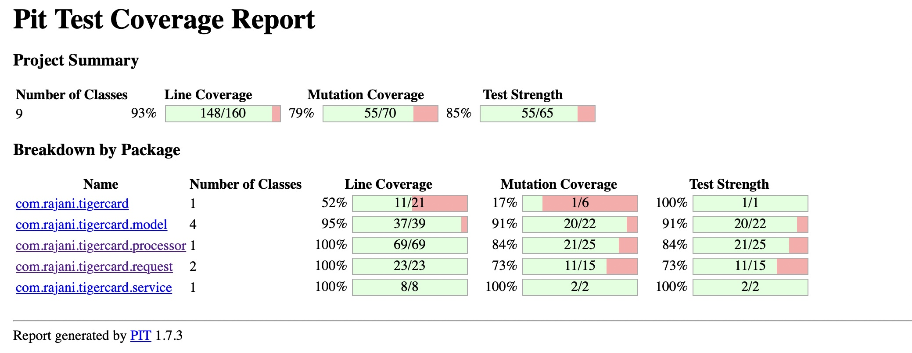

# TigerCard Application

## Assumptions
- Tickets are in the sorted order of date time (just like how one uses a card)
- Application processes all tickets of one user per run
- time interval for peak times is exclusive. Meaning peak interval 10:00 to 11:00 does not include 10:00:00 and 11:00:00

## Testing
### Unit Testing
* Test case be run either from mvn command line or intellij 

```mvn test``` and ```mvn jacoco:report``` will give the test result. Report can be opened using ```open target/site/jacoco/index.html```


### pit mutation testing
* Mutation coverage can me run from mvn command line

```mvn org.pitest:pitest-maven:mutationCoverag```. Report can be opened using ```open target/pit-reports/202112051647/index.html```


### manual testing
* com.rajani.tigercard.TigerCardApplication.main can be used to run from command line

  sample input to process two tickets:
  
  ```
  2
  2007-12-01T10:15:30, ONE, ONE
  2007-12-01T04:15:30, ONE, ONE
  ```
